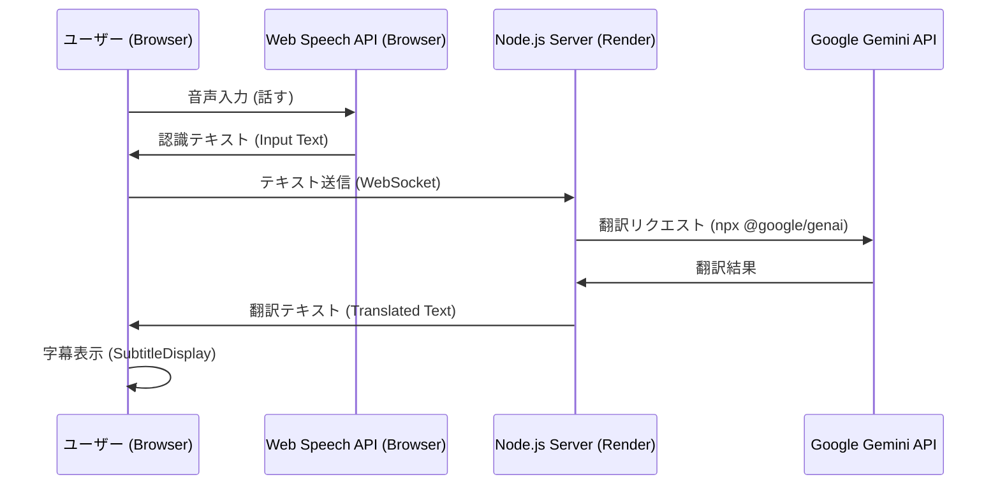

# アプリケーション構成図 (2025-01-27 現在)

## 1. 全体アーキテクチャ

このアプリケーションは、**ブラウザ標準の音声認識**と**Google Gemini**による翻訳を組み合わせた、リアルタイム翻訳ツールです。

## 2. 技術スタック

| コンポーネント | 技術 | 役割 |
|---|---|---|
| **フロントエンド** | React (Vite) | UI表示、音声認識制御、WebSocket通信 |
| **音声認識** | **Web Speech API** | ブラウザ標準機能 (無料)。マイク入力をテキスト化 |
| **バックエンド** | Node.js (ws) | WebSocketサーバー。クライアントとGeminiの仲介 |
| **翻訳エンジン** | **Google Gemini 2.0 Flash** | 高速・高精度な翻訳 (無料枠あり) |
| **デプロイ** | Vercel (Front) / Render (Back) | ホスティング環境 |

## 3. 主要機能

### 音声認識 (STT)
- ブラウザの `window.SpeechRecognition` を使用。
- 外部API (Deepgram等) を使用しないため、**音声認識は完全無料**。

### 翻訳 (Translation)
- サーバー側で Google Gemini API を呼び出し。
- モデル: `gemini-2.5-flash` (高速モデル)。
- プロンプトにより「自然な字幕」として翻訳するように指示。

### UI / UX
- **日本語対応**: 全てのインターフェースが日本語化済み。
- **入力モニタリング**: 認識された元の言葉と、翻訳結果を同時に表示。
- **テスト機能**: マイク入力をシミュレーションするボタンを搭載。
- **クロマキー**: OBS配信向けに、背景色をグリーン/ブルー/マゼンタに変更可能。

## 4. 環境変数

| 変数名 | 場所 | 役割 |
|---|---|---|
| `API_KEY` | `.env` (Server) | Google Gemini API キー |
| `VITE_BACKEND_URL` | `.env` (Front) | バックエンドのWebSocket URL (Render等のURL) |

## 5. 以前からの変更点
- **Deepgram 廃止**: 有料APIへの依存を削除しました。
- **サーバー役割変更**: 音声ストリームの中継ではなく、テキストの中継のみを行うようになりました。
